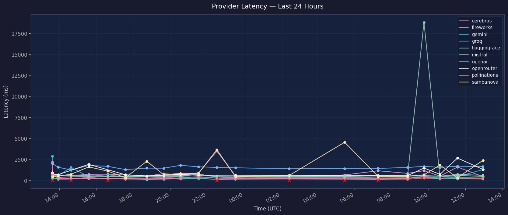
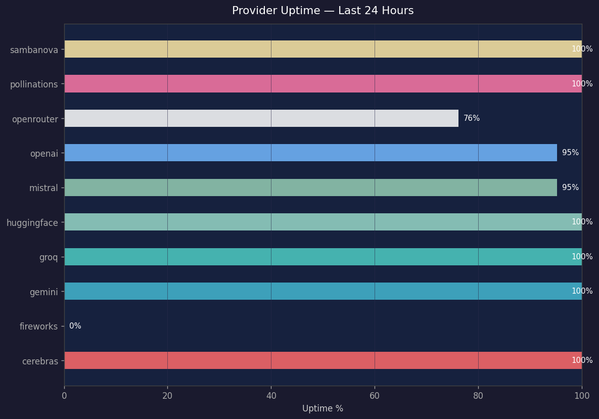

# The Brain


*Image generated by Pollinations.ai (free, no API key) — automatically offloaded from Claude to save tokens.*

> Claude orchestrates. Free AI does the heavy lifting. Git remembers everything.

## Why I built this

I was paying $20/month for Claude Pro and kept running out of tokens — it felt like 1998 AOL dial-up screeching to a halt mid-sentence. So I built The Brain: an orchestration system that offloads as much AI work as possible to free providers like Groq, Gemini, Mistral, and Cerebras, while Claude handles only the decisions and orchestration. Now I get smart AI assistance without the token anxiety. No more dial-up drama.

---

**The Brain** is an AI orchestration system where Claude acts as the intelligent dispatcher, routing every task to the cheapest and most capable AI provider available — saving Claude tokens for decisions, planning, and conversation only.

```
You → Orchestrator (Claude) → Router
                                 ↓
              ┌──────────────────────────────────────┐
              │  classification  →  Cerebras (FREE)  │
              │  summarisation   →  Gemini   (FREE)  │
              │  coding          →  Mistral  (FREE)  │
              │  creative        →  Mistral  (FREE)  │
              │  general         →  Groq     (FREE)  │
              │  image           →  Pollinations     │
              └──────────────────────────────────────┘
                                 ↓
                         stats/usage.json
                                 ↓
                         Nightly GitHub Action → README update
```

---

## Why this architecture

| Problem | Solution |
|---|---|
| Claude tokens are expensive | Route simple tasks to free models |
| Different AIs excel at different tasks | Smart routing table per task type |
| Hard to track what was used | Every call logged to stats/usage.json |
| Want to know savings | Nightly report shows tokens saved vs Claude cost |

---

## Active Providers

### Free — API key required (no credit card)

| Provider | Model | Best for | Speed | Sign up |
|---|---|---|---|---|
| **Cerebras** | Llama 3.1 8B | Classification, scoring, yes/no | ~284ms | [cloud.cerebras.ai](https://cloud.cerebras.ai) |
| **Groq** | Llama 3.1 8B Instant | Factual Q&A, general tasks | ~366ms | [console.groq.com](https://console.groq.com) |
| **Gemini** | 2.5 Flash Lite | Summarisation, long text (1M context), translation | ~541ms | [aistudio.google.com](https://aistudio.google.com/app/apikey) |
| **Mistral** | Mistral Small | Coding, creative writing, extraction | ~1172ms | [console.mistral.ai](https://console.mistral.ai) |
| **HuggingFace** | Llama 3 8B | Open-source fallback | ~924ms | [huggingface.co/settings/tokens](https://huggingface.co/settings/tokens) |
| **SambaNova** | Llama 3.3 70B | High-quality free inference | ~11s | [cloud.sambanova.ai](https://cloud.sambanova.ai) |
| **Fireworks AI** | DeepSeek V3 | Fast general inference, free tier | ~1963ms | [fireworks.ai](https://fireworks.ai) |
| **OpenAI** | GPT-4o-mini | Coding, structured output, general tasks | ~2372ms | [platform.openai.com](https://platform.openai.com/api-keys) |

### Free — no key, no sign-up

| Provider | Capability | Notes |
|---|---|---|
| **Pollinations.ai** | Text + Image generation | HTTP GET only, zero setup, FLUX model for images |

---

## Providers NOT in use — and why

| Provider | Reason |
|---|---|
| **xAI (Grok)** | Free API tier removed in 2026 |
| **OpenRouter** | Free tier is rate-limited and unreliable in practice |
| **Cohere** | API key was never properly configured (placeholder value) |
| **DeepSeek** | Key is valid but account has no balance |
| **Together AI** | Credit limit exceeded — needs payment added |
| **Anthropic (direct)** | Key not configured — would be paid anyway; Claude is already the orchestrator |
| **Ollama** | Local-only, requires local installation — no cloud option |
| **DuckDuckGo AI** | Officially blocked/archived as of January 2026 |
| **GPT4Free (g4f)** | Providers break daily — too fragile for a stable system |
| **mlvoca.com** | Unproven, very new service |

---

## Quick start

### 1. Clone and install

```bash
git clone https://github.com/SoylentAquamarine/the-brain.git
cd the-brain
pip install -r requirements.txt
```

### 2. Configure API keys

```bash
# Edit .env and paste in your keys
GROQ_API_KEY=...
GEMINI_API_KEY=...
MISTRAL_API_KEY=...
CEREBRAS_API_KEY=...
HUGGINGFACE_API_KEY=...
SAMBANOVA_API_KEY=...
FIREWORKS_API_KEY=...
OPENAI_API_KEY=...
```

### 3. Offload a task

#### Cerebras — fastest inference (~1500 tok/s), best for classification
**Available models:** `llama3.1-8b` (default) · `qwen-3-235b-a22b-instruct-2507` · `gpt-oss-120b`
```bash
python delegate.py --provider cerebras --type classification --prompt "Is this positive or negative: 'Great product!'"
python delegate.py --provider cerebras --type factual_qa     --prompt "What is the capital of France?"
```

#### Groq — very fast, great all-rounder
**Available models:** `llama-3.1-8b-instant` (default) · `meta-llama/llama-4-scout-17b-16e-instruct` · `qwen/qwen3-32b` · `groq/compound`
```bash
python delegate.py --provider groq --type factual_qa   --prompt "What year was Python created?"
python delegate.py --provider groq --type general      --prompt "Explain REST APIs in plain English"
```

#### Gemini — huge context window (1M tokens), best for long documents
**Available models:** `gemini-2.5-flash-lite` (default) · `gemini-2.5-flash` · `gemini-2.5-pro` · `gemini-2.0-flash` · `gemma-3-27b-it`
```bash
python delegate.py --provider gemini --type summarization --prompt "Summarise this 50-page document: ..."
python delegate.py --provider gemini --type translation   --prompt "Translate to Spanish: ..."
```

#### Mistral — best free model for coding and creative writing
**Available models:** `mistral-small-latest` (default) · `mistral-medium-latest` · `codestral-latest` · `devstral-latest` · `open-mistral-nemo`
```bash
python delegate.py --provider mistral --type coding    --prompt "Write a Python function that sorts a list of dicts by key"
python delegate.py --provider mistral --type creative  --prompt "Write a cover letter for a software engineer role at Stripe"
python delegate.py --provider mistral --type extraction --prompt "Extract all skills mentioned in this job posting: ..."
```

#### OpenAI — strong all-rounder, free tier
**Available models:** `gpt-4o-mini` (default) · `gpt-4o` · `gpt-5.4-mini` · `gpt-5.4` · `gpt-3.5-turbo`
```bash
python delegate.py --provider openai --type coding    --prompt "Write a regex to validate email addresses"
python delegate.py --provider openai --type reasoning --prompt "What are the trade-offs between SQL and NoSQL databases?"
```

#### HuggingFace — open-source model variety, free fallback
**Available models:** `meta-llama/Meta-Llama-3-8B-Instruct` (default) · `mistralai/Mistral-7B-Instruct-v0.3` · `HuggingFaceH4/zephyr-7b-beta`
```bash
python delegate.py --provider huggingface --type general      --prompt "Summarise the key points of this paragraph: ..."
python delegate.py --provider huggingface --type factual_qa   --prompt "What is machine learning?"
```

#### SambaNova — free 70B model, highest quality of the free providers
**Available models:** `Meta-Llama-3.3-70B-Instruct` (default) · `Llama-4-Maverick-17B-128E-Instruct` · `DeepSeek-V3.1` · `DeepSeek-V3.2` · `gemma-3-12b-it`
```bash
python delegate.py --provider sambanova --type reasoning   --prompt "Analyse the pros and cons of microservices architecture"
python delegate.py --provider sambanova --type creative    --prompt "Write a detailed blog post about AI orchestration"
```

#### Fireworks — fast inference, free tier
**Available models:** `accounts/fireworks/models/deepseek-v3p1` (default) · `accounts/fireworks/models/deepseek-v3p2` · `accounts/fireworks/models/kimi-k2p5` · `accounts/fireworks/models/gpt-oss-120b`
```bash
python delegate.py --provider fireworks --type coding   --prompt "Write a Python class for a binary search tree"
python delegate.py --provider fireworks --type general  --prompt "What are the SOLID principles?"
```

#### Pollinations — no key needed, text and images
```bash
# Text
python delegate.py --provider pollinations --type general  --prompt "Write a haiku about coding"
# Image — use the adapter directly
python -c "from brain.adapters.pollinations_adapter import PollinationsAdapter; ..."
```

#### Override the model for any provider
```bash
# Use Groq with the larger Llama 4 Scout model
GROQ_MODEL=meta-llama/llama-4-scout-17b-16e-instruct python delegate.py --provider groq --type reasoning --prompt "..."

# Use Mistral's code-specific model
MISTRAL_MODEL=codestral-latest python delegate.py --provider mistral --type coding --prompt "..."

# Use Gemini Pro instead of Flash Lite
GEMINI_MODEL=gemini-2.5-pro python delegate.py --provider gemini --type summarization --prompt "..."
```

### 4. Check status

```bash
python status.py
```

### 5. View usage report

```bash
python report.py
```

---

## Routing guide

| Task | Use | Why |
|---|---|---|
| Classify, label, yes/no | `cerebras` | Fastest (~1500 tok/s), free |
| Quick factual Q&A | `groq` | Fast, reliable, free |
| Summarise long text | `gemini` | 1M token context, free |
| Code generation | `mistral` | Best free coding model |
| Creative writing / drafting | `mistral` | Best quality output, free |
| Translation | `gemini` | Strongest multilingual, free |
| Image generation | `pollinations` | No key needed |
| High-quality, no rush | `sambanova` | 70B model, free, slower |
| General fallback | `fireworks` | DeepSeek V3, free |
| General fallback (GPT-4o-mini) | `openai` | Strong all-rounder, free tier |

---

## Project structure

```
the-brain/
├── delegate.py              # Call this to offload a task to a free AI worker
├── status.py                # Live provider dashboard + usage stats
├── report.py                # Usage report (human-readable)
├── update_readme_stats.py   # Auto-update this README with stats
├── INTEGRATION.md           # How to wire a new workflow window into the-brain
├── brain/
│   ├── orchestrator.py      # Core dispatcher
│   ├── router.py            # Routing table
│   ├── stats.py             # Persistent usage tracking
│   └── adapters/            # One file per provider
├── stats/usage.json         # Running usage log (auto-created)
├── assets/brain.png
└── .github/workflows/
    └── nightly-stats.yml    # Midnight UTC — updates this README automatically
```

---

## Nightly stats update

A GitHub Actions workflow runs every night at midnight UTC. It reads
`stats/usage.json`, updates the stats block below, and commits back to
the repo automatically. Push your local `stats/usage.json` after each
session so the report stays current.

---

<!-- BRAIN_STATS_START -->
*Last updated: 2026-04-19 02:57 UTC — auto-generated by `update_readme_stats.py`*

## Live Usage Stats

| Provider | Tier | Calls | Tokens | Avg Latency | Cost |
|---|---|---|---|---|---|
| **mistral** | FREE | 4 | 3,424 | 2089ms | free |
| **cerebras** | FREE | 4 | 1,236 | 338ms | free |
| **groq** | FREE | 1 | 541 | 1145ms | free |
| **gemini** | FREE | 2 | 225 | 651ms | free |
| **openai** | ? | 1 | 89 | 2780ms | $0.0000 |
| **deepseek** | ? | 1 | 0 | 1007ms | free |

### Token Savings

| Metric | Value |
|---|---|
| Total calls | 13 |
| Calls handled by free workers | 13 |
| Tokens offloaded from Claude | 5,515 |
| % of tokens saved | 100.0% |
| Estimated savings (Claude Sonnet rate) | $0.0165 |
| Total spend on paid APIs | $0.0000 |

### Token Distribution

```
mistral      [FREE]  ███████████████████████████████                     62.1%
cerebras     [FREE]  ███████████                                         22.4%
groq         [FREE]  ████                                                 9.8%
gemini       [FREE]  ██                                                   4.1%
openai       [?]                                                       1.6%
deepseek     [?]                                                       0.0%
```
<!-- BRAIN_STATS_END -->

---

## Using Claude Code with The Brain

This section explains how to wire up your own local Claude Code instance so it
automatically offloads AI tasks to free workers — the same setup used to build
and maintain this project.

### What is Claude Code?

Claude Code is Anthropic's CLI tool that runs Claude directly in your terminal
with full access to your file system, git, and shell. Unlike the web chat, it
can execute commands, read and write files, and follow persistent instructions
stored in a `CLAUDE.md` file in your project.

Download it from: **[claude.ai/code](https://claude.ai/code)**

**Does it work on the free tier?**
No — Claude Code requires a Claude Pro subscription ($20/month) or an Anthropic
API key with credits. But that is exactly why this project exists. With The Brain
doing the heavy lifting, Claude handles almost nothing directly — it just decides
who to call and relays the result. In a typical session, 100% of AI tokens go to
free workers. You pay $20/month for the orchestrator; the actual work is free.

---

### Step 1 — Clone the repo and install dependencies

```bash
git clone https://github.com/SoylentAquamarine/the-brain.git
cd the-brain
pip install -r requirements.txt
```

---

### Step 2 — Add your API keys

Copy the example env file and fill in your keys. All providers listed have
free tiers — no credit card required for most of them.

```bash
# Create your .env file
cp .env.example .env   # or create it manually

# Add keys for the providers you want — you don't need all of them
GROQ_API_KEY=...        # https://console.groq.com
GEMINI_API_KEY=...      # https://aistudio.google.com/app/apikey
MISTRAL_API_KEY=...     # https://console.mistral.ai
CEREBRAS_API_KEY=...    # https://cloud.cerebras.ai
HUGGINGFACE_API_KEY=... # https://huggingface.co/settings/tokens
SAMBANOVA_API_KEY=...   # https://cloud.sambanova.ai
FIREWORKS_API_KEY=...   # https://fireworks.ai
OPENAI_API_KEY=...      # https://platform.openai.com/api-keys
```

Even with just one or two keys you get meaningful offloading. Groq + Gemini
covers most use cases for free.

---

### Step 3 — Open the project in Claude Code

```bash
cd the-brain
claude
```

That's the key step. When Claude Code starts inside a directory it
**automatically reads `CLAUDE.md`** and follows it as standing instructions for
the entire session. The `CLAUDE.md` in this repo tells Claude to:

- Route classification and scoring → Cerebras
- Route summarisation → Gemini
- Route coding and creative writing → Mistral
- Route analysis and reasoning → SambaNova
- Route general questions → Groq
- Keep only git, file I/O, and orchestration decisions for itself

You don't have to configure anything else. Open the folder, Claude picks up
the instructions and starts offloading automatically.

---

### Step 4 — Verify it is working

Type `status` in the Claude Code window:

```
status
```

You should see a dashboard showing which providers are online and any usage
stats accumulated so far. If all your keys are valid, all providers will show
as `[online]`.

To test a live offload:

```bash
python delegate.py --provider groq --type factual_qa --prompt "What is 2+2?"
```

---

### Step 5 — Push stats so the nightly report captures your usage

Every `delegate.py` call writes to `stats/usage.json` locally. Push it to
GitHub so the nightly action picks it up:

```bash
git add stats/usage.json
git diff --staged --quiet || git commit -m "chore: session stats"
git push
```

Add this to the end of any workflow or script that calls `delegate.py` to keep
stats current automatically.

---

### Step 6 — Enable the nightly GitHub Actions report (optional)

The repo includes `.github/workflows/nightly-stats.yml` which runs at midnight
UTC every day. It reads `stats/usage.json`, updates the README stats block, and
commits back automatically.

To enable it on your own fork:
1. Fork the repo on GitHub
2. Go to **Actions** tab → enable workflows if prompted
3. Add your API keys as GitHub Secrets if you want the workflow to call
   providers directly (not required — it only reads the stats file)
4. Push any `stats/usage.json` changes and the next midnight run will
   update your README automatically

---

### How CLAUDE.md works — the short version

Any file named `CLAUDE.md` in a project directory (or any parent directory) is
automatically loaded by Claude Code at session start. It acts like a permanent
system prompt for that project. You can:

- Tell Claude which tools to use
- Define workflows and shortcuts (`status` → run `python status.py`)
- Set routing rules (what to offload, what to keep)
- Document project conventions

Editing `CLAUDE.md` and reopening the project is all it takes to change
Claude's default behaviour for that window. The offloading rules in this repo's
`CLAUDE.md` are a working example — copy and adapt them for your own projects.

---

<!-- HEALTH_START -->
## Provider Health

*Last check: 2026-04-19 12:56 UTC — auto-generated by health-check.yml*

| Provider | Status | Last Latency | Avg Latency (24h) | Uptime (24h) |
|---|---|---|---|---|
| **cerebras** | OK | 248ms | 209ms | 100% |
| **fireworks** | WARN | 450ms | 890ms | 0% |
| **gemini** | OK | 1292ms | 636ms | 100% |
| **groq** | OK | 172ms | 214ms | 100% |
| **huggingface** | OK | 622ms | 593ms | 100% |
| **mistral** | OK | 467ms | 1395ms | 95% |
| **openai** | OK | 1652ms | 1566ms | 95% |
| **openrouter** | OK | 1315ms | 956ms | 76% |
| **pollinations** | OK | 282ms | 382ms | 100% |
| **sambanova** | OK | 2391ms | 1227ms | 100% |

### Latency over time (last 24h)



### Uptime (last 24h)


<!-- HEALTH_END -->

---

## License

MIT — build on it, fork it, ship it.
